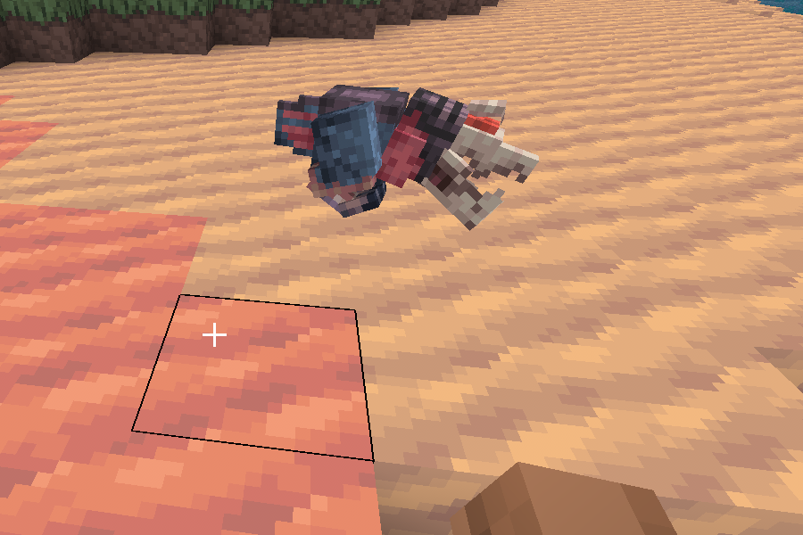

# Minetest-Tremors

*(Se você tiver um banner/screenshot legal na raiz do repositório, ele aparece aqui)*

**Tremors** é um mod para **Minetest** / **Luanti** que traz criaturas subterrâneas inspiradas nos clássicos filmes *Tremors* (O Ataque dos Vermes Malditos) e *Tremors II: Aftershocks* (O Ataque dos Vermes Malditos 2) para o seu mundo de blocos. Atualmente inclui:

- **Graboid** — a larva gigante que cava túneis e ataca de surpresa.
- **Shrieker** — a criatura bípede que grita, caça no escuro e ataca com ferocidade.

O mod está em desenvolvimento ativo, mas já é jogável e traz uma experiência de terror/sobrevivência única para servidores e mundos singleplayer.

## Características principais

- Modelos 3D animados (usando glb, formato moderno e recomendado no Luanti 5.10+)
- Animações fluidas: idle, walk, run, angry e ataque
- Sons autênticos (gritos, ataques, idle, dor e morte)
- IA baseada na API mobs_redo (compatível com a maioria dos mods de mobs)
- Spawns naturais em cavernas, desertos e áreas escuras
- Drops básicos (carne crua por enquanto – planejo itens mais interessantes)
- Compatível com **Mineclonia** e outros subgames que usam a API mobs_redo

## Requisitos

- **Minetest / Luanti** ≥ **5.10.0** (recomendado 5.14+ para melhor suporte a glTF)
- Mod **mobs** (por TenPlus1) — [baixe aqui](https://content.luanti.org/packages/TenPlus1/mobs/)
- Opcional: mods de som ou mobs extras para mais imersão

## Instalação

1. Baixe este repositório como ZIP ou clone via git:
git clone https://github.com/kingwederson/minetest-tremors.git tremors

2. Coloque a pasta `tremors` dentro da pasta de mods do seu Minetest/Luanti:
- Windows: `C:\Users\SeuNome\Minetest\mods\`
- Linux/Flatpak: `~/.var/app/org.luanti.luanti/.minetest/mods/`
- Android: use o gerenciador de mods do jogo.

3. Ative o mod no menu de configuração do mundo (ou adicione `load_mod = tremors` no world.mt)

4. Ative também o mod **mobs** (dependência obrigatória)

5. (Opcional) Para spawn mais frequente, edite o `init.lua` e diminua o `chance` no `mobs:spawn()`

## Como jogar

- Os Shriekers spawnam principalmente em áreas escuras e subterrâneas.
- Cuidado com o barulho — eles são atraídos por som e movimento!
- Use tochas, armadura e armas fortes. Eles são resistentes e atacam em grupo quando provocados.
- Por enquanto não há como domesticar ou reproduzir — são monstros puros.

## Créditos e agradecimentos especiais

- **Modelagem 3D e animações originais** — Obrigado imensamente à **@ppinheirosiqueira** pela incrível ajuda na conversão e finalização dos modelos para o formato glTF (.glb). Sem sua expertise em Blockbench e Blender, o Shrieker não estaria tão bonito e animado como está hoje! ❤️

- Sons e ideias gerais — inspirados no universo Tremors (filmes e jogos)

- API — usa **mobs_redo** do TenPlus1 (obrigado pela base sólida!)

- Desenvolvedor principal — Wederson (@kingwederson)

## Licença

Este mod está licenciado sob **MIT License** (veja o arquivo LICENSE).

Você pode usar, modificar, redistribuir e incluir em pacotes/packs de mods, desde que mantenha o crédito aos autores originais.

## Contribuições

Quer ajudar? Bem-vindo!

- Reporte bugs ou sugira melhorias abrindo uma **Issue**
- Envie **Pull Requests** com novos mobs (ex: Ass-Blaster), sons, drops, mecânicas de spawn, etc.
- Teste em Mineclonia e me diga se precisa de ajustes específicos

## Roadmap (planejamento futuro)

- Adicionar o **Graboid** (a fase 1)
- Adicionar o **Ass-Blaster** (a fase 3)
- Itens dropados úteis (ex: pele resistente, etc.)
- Spawn condicional (ex: só em biomas específicos ou após certa profundidade)
- Sons mais variados e triggers por distância
- Possibilidade de "tremor" no chão quando Graboid se aproxima
- Integração com mods de armas/magia para combate mais épico

Se você gosta de terror, survival hardcore ou só quer assustar seus amigos no servidor, baixe, instale e divirta-se (ou sofra) com Tremors!

Qualquer dúvida, me chama no X: [@kingwederson](https://x.com/kingwederson)

Bom jogo e cuidado com os Shriekers no escuro! 🕳️🔊

Última atualização: Janeiro 2026
